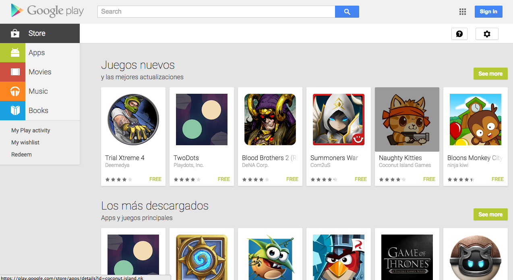
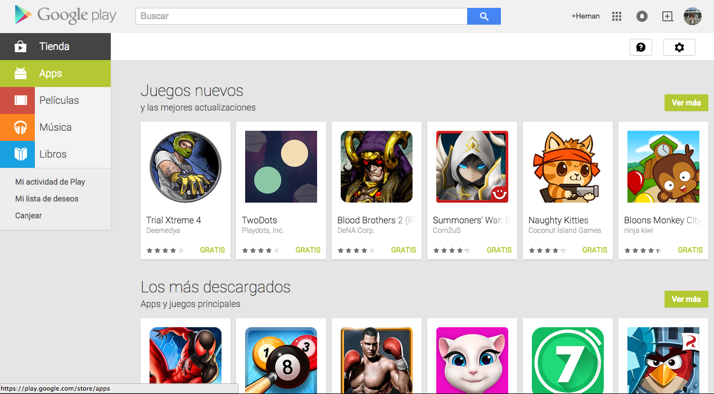
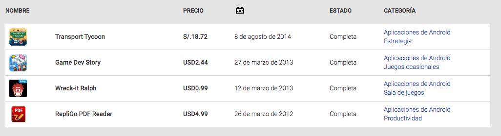
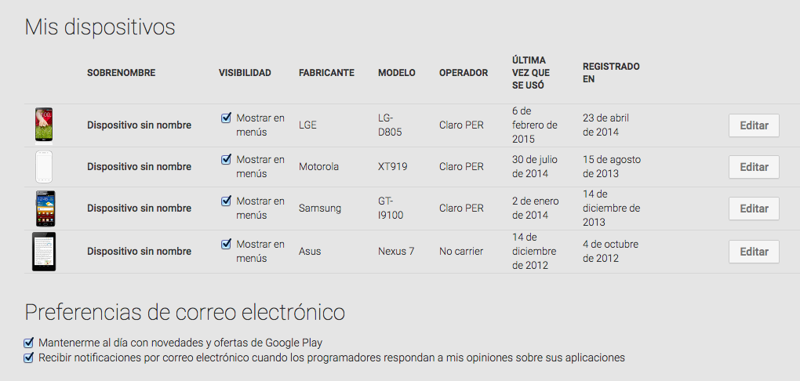
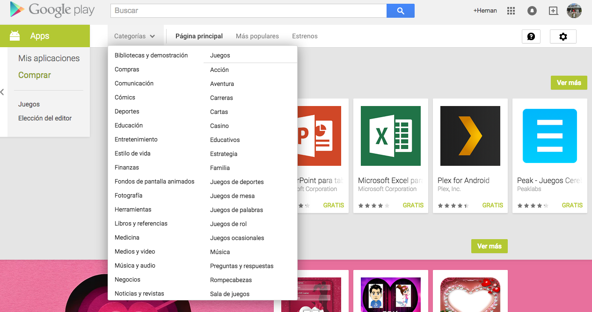
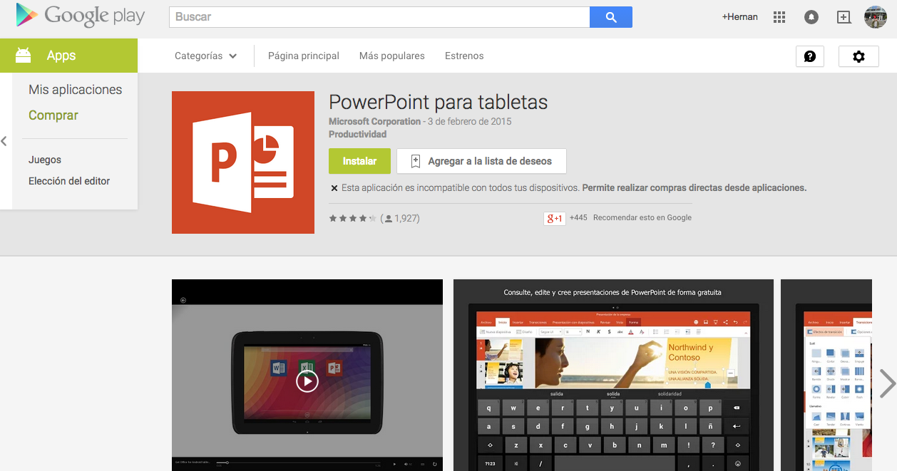
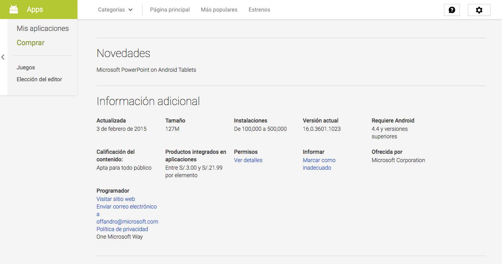
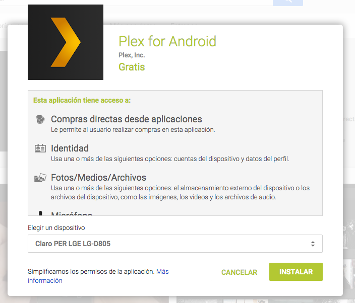

Guía de Google Play Store
=========================

== Introducción

La presente guía sirve como referencia para la configuración y uso de una cuenta
en Google Play Store.

Google Play Store (http://play.google.com/) es el canal de distribución
principal de aplicaciones para Android. En esta página usted podrá descargar
las aplicaciones que desee instalar en sus dispositivos móviles.

Estos markets pueden ser accedidos ya sea desde el navegador de una computadora
(Chrome, Firefox, Safari, Internet Explorer, etc.) o desde los propios
dispositivos móviles.

== Loguearse en su cuenta

Para poder ingresar al market, debe de tener una cuenta gmail activa. En caso de
no tener, ir a http://www.gmail.com y obtenerla.

Dirigirse a la página http://play.google.com y hacer click en el botón azul
"Sign in".

Posteriormente, ingresar los datos de su cuenta gmail (usuario y contraseña).

Luego verá su pantalla principal con un menú de los tipos de contenido que
usted puede obtener en el market.

* Apps
* Películas
* Música
* Libros

== Configuración de su cuenta

Al hacer click en el engranaje image:engranaje[engranaje] (parte superior derecha)
tendrá las siguientes opciones:

* Mis pedidos: Se listan todas el contenido comprado por el market.

* Configuración: Se muestran todos los dispositivos vinculados a su cuenta gmail.

* Administración de dispositivos: Para poder gestionar el dispositivo móvil desde
cualquier lugar.

== Buscar una app

En la parte izquierda, uno puede ver las aplicaciones que se han comprado (Mis
 Aplicaciones), así como las que están disponibles para adquirir (Comprar).

Dentro de las aplicaciones que uno tiene disponible para adquirir, las puede
filtrar por "Categorías", ver cuáles son más populares y cuales son estrenos.

== Descargar e instalar una app

Para poder descargar una app, solamente hacer click en la que les interese.

Al hacer esto, podrá ver información referente a la app como:

* El fabricante
* Dispositivos para los cuales es compatible la app
* Rating
* Imagenes y/o videos
* Descripción
* Opiniones (muy importante)
* Información adicional
* Aplicaciones similares y otras apps del fabricante

Para proceder a la instalación de la aplicación, hacer click en el botón "Instalar".

Luego aparecerá una pantalla donde uno debe confirmar la instalación de la app.
Tomar en cuenta que es muy importante leer los accesos que esta aplicación pide.

